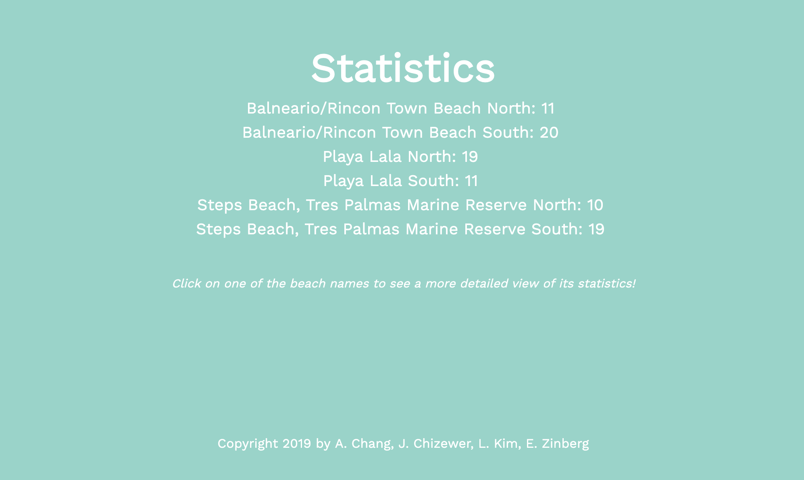
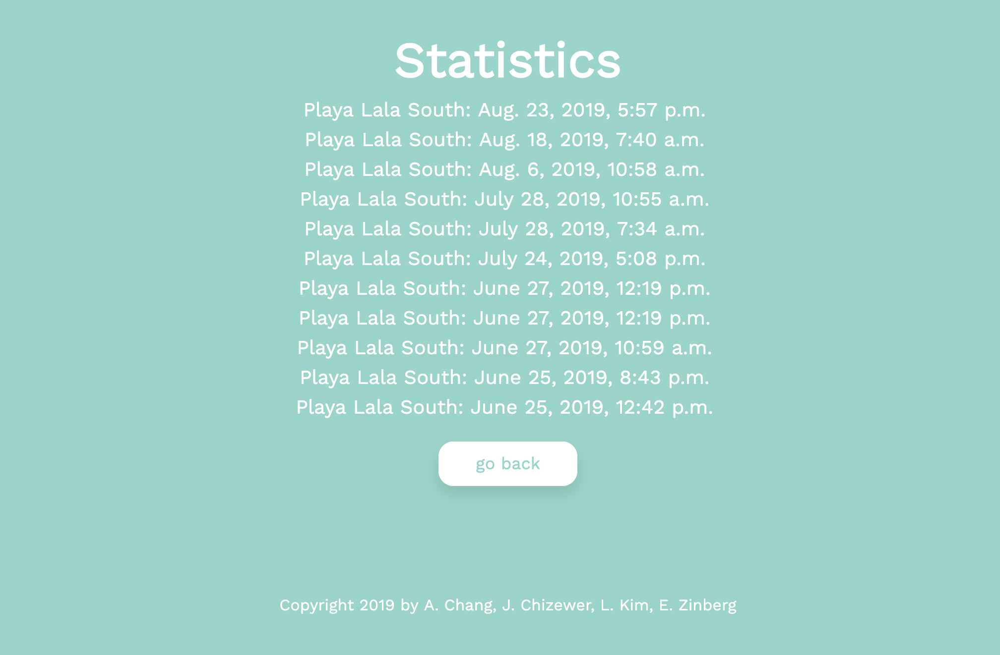

__**Technical Skills/Technologies Used:**__ Django, Python, PostGres, Heroku, HTML & CSS

During my summer in Puerto Rico, I, along with three others, was able to work with the SurfRider Rincon chapter to help test the water of the local beaches for high levels of hazardous bacteria. This information was disseminated weekly to the SurfRider website; however, it was very difficult to navigate and find the correct page that contained the desired information. Steve Tamar, the vice head of the Rincon chapter, expressed his worry about locals and visitors wandering into the water unsuspectingly and asked us to come up with a way to circumvent this issue. 

Initially, we planned to create a location-based website that would notify the user when he/she were near one of the testing sites and display the water quality. However, we quickly realized that this would be problematic and impractial because the user would need to already be on the website for it to work and it would require location services, something beyond all of our areas of expertise.

Ultimately, we decided the easiest solution would be to post QR codes near the entrances of the beaches that redirected to the proper SurfRider website. Because Steve wanted to see how effective this method was, he asked us if we would be able to count the number of hits each QR code received. To do this, we created a website to be a sort of "middle man" - once a person scanned the QR code, he/she would be re-routed to our website, where the metrics of QR code hits would update, then taken directly to the correct SurfRider website that contained the water safety information.

Because the SurfRider websites we needed to reroute to all followed the same formula and each beach had an identification code, the process was pain-free. The site was a simple Django site based off my knowledge from working on [TigerRide](http://anabelle-chang.netlify.com/projects/tigerride). First, using the identification values, I was able to use Django's models to save each beach, its corresponding code, and the number of QR code hits. We then generated a QR code for each water testing site. Once scanned, a QR code would first reroute to the Django website with identification code as a slug, and our website would find the beach in the model using Django's built in filtering functions and update the QR code metrics. Then, I simply appended the slug to the end of the proper SurfRider URL, and the user would be on his/her merry way to seeing whether or not the water was safe.

Here are some snapshot of the website (and my basic attempt at HTML and CSS):

Overall, this was a very basic project, but I'm glad we were able to do something to help everyone be more cognizant of the hazards of unsafe water. It was honestly a pleasure working with Steve and I hope this project will help the community out! :)