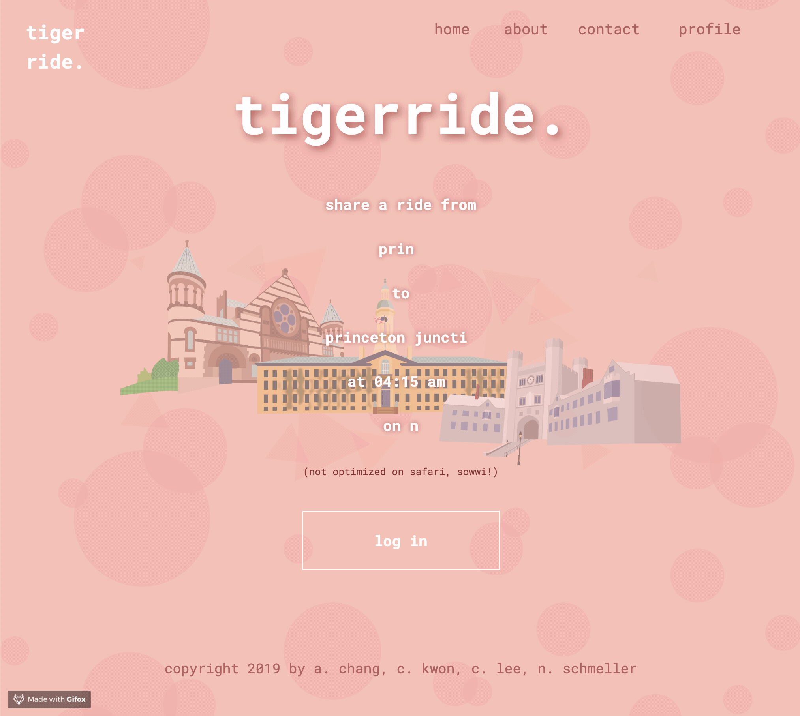
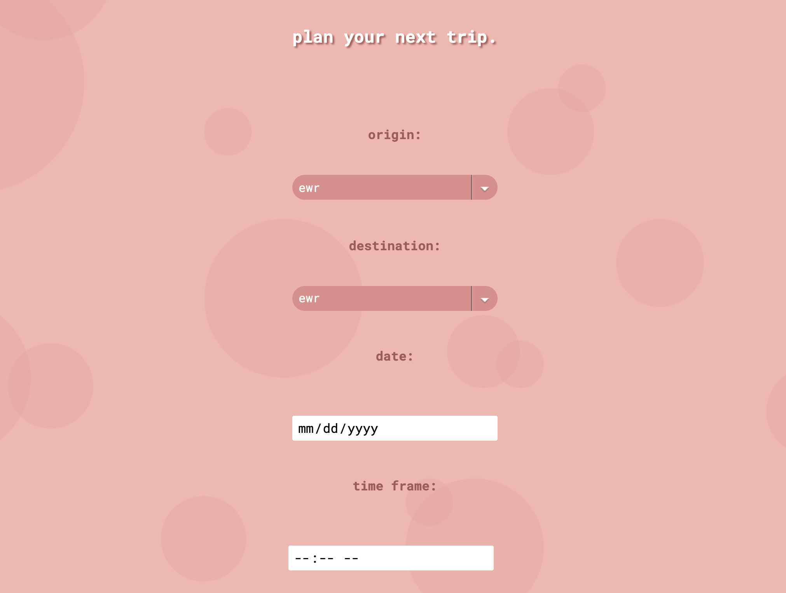
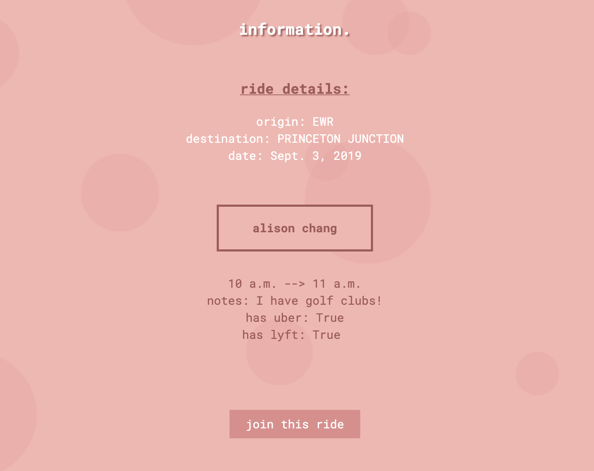
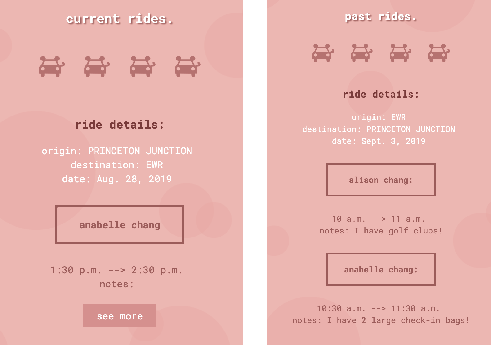
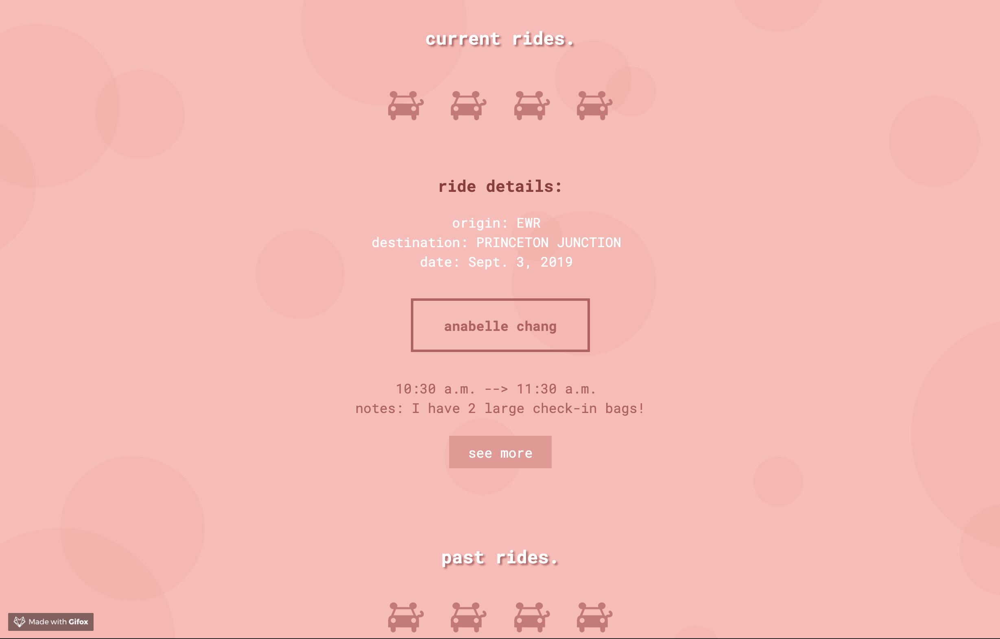
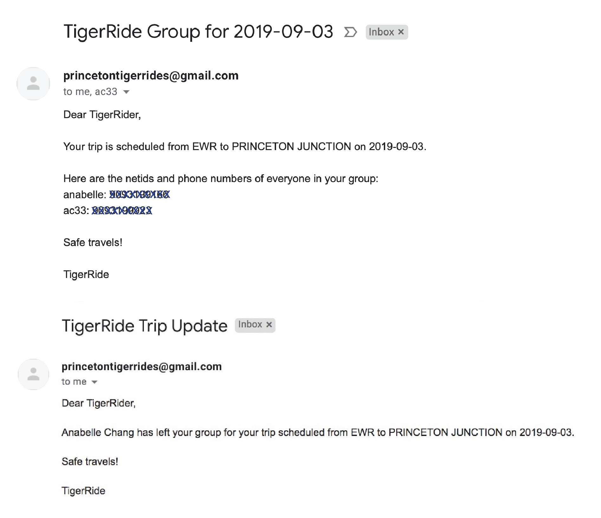

__**Technical Skills/Technologies Used:**__ Django, Python, PostGres, Heroku

During the course COS333: Advanced Programming Techniques, I, along with a few others, created a web application that would allow for students to organize sharing Uber, Lyft, or other transportation services to and from the Princeton University campus. I was mostly in charge of the back-end development, but I also dabbled a bit in databases using PostGres.

Each student who wanted to use our app to search for other students would first fill out a form which would save their origin, destination, date, time interval during which they could take an Uber/Lyft, and other miscellaneous but pertinent information:

To find any matches, I saved the form with Django's built-in form functionality to a Django model. Then, I used the **.filter()** function to search for other students with the same information. If any ride-share partners were found, the student could then to opt to join the group:

Joining groups was done by having unique identification numbers for each planned trip -- so, when a student joined the ride-share group, his/her ride identification value would be updated to be the same as that of the ride-share group. On the other hand, when a student wanted to leave the ride-share group, his/her ride idenfication value would change to be a unique number. 

We also included a page where each student could view his/her ride history, which included past and present rides:

This was useful because if upon the first search the student did not have any matches, the student could revisit the search results for his/her planned trip later on in the "current rides" section. 

To add this functionality, I embedded the ride identification number into the button, therefore allowing for easy access and manipulation of the trip/model's data. I opted to do it this way instead of using URL slugs so the user would not be able to manipulate our website improperly (i.e. be able to continue to search for ride partners if he/she were already in a group). 

I was also able to use this technique to additional options for the user to leave or complete a ride if he/she were in a group and to delete a ride or continue to search if he/she were not in a group.

Because our app was not a mobile app but rather web-based, I decided to incorporate email notifications with Django's built-in plugin whenever a rider joined or left a group. This way, all members of the group could get in touch and be kept up to date with one another. 

<!-- 
any students who were traveling on the same date/time to and from the same locations
After filling out the form, which used the built-in Django form functionality, I saved the information to a Django model. 

The app connects students who were traveling on the same date to and from the same locations. In order to do so, I used the Django model and form functionalities.  -->

This was the first time I was able to develop an idea from start to finish, and it was definitely a very rewarding experience during which I learned many new technologies, how to troubleshoot problems/bugs, and the benefits of being more open to asking for help. It's safe to say that TigerRide was not made without any major roadblocks -- during the early stages of our development, we were unable to transfer from SQLite3 to a PostGres database, a problem that we were only able to fix with a major sacrifice in terms of our efficiency. While it was easy to get frustrated, I think this process just taught me to be more tenacious and to always follow things to completion. I'm so grateful for my team, adviser and professor in all their help during the process, and I can't wait to continue to explore CS creatively! :)

You can visit it [here](http://tigerride.herokuapp.com).  

