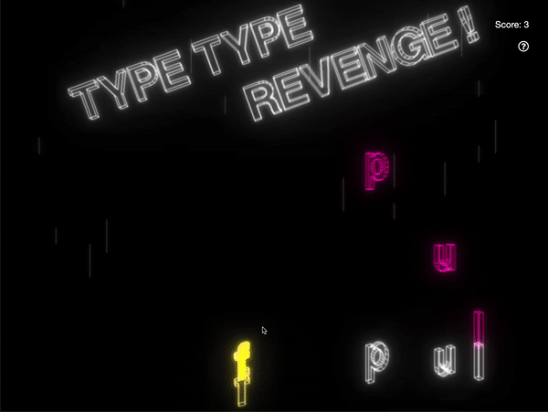
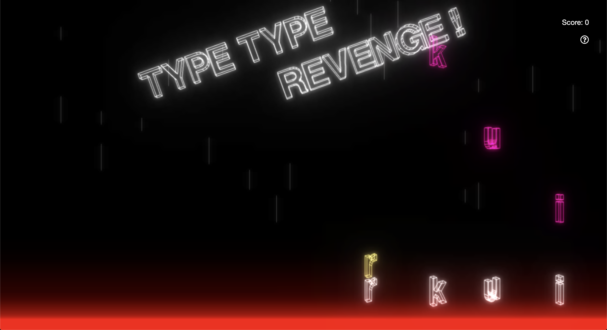
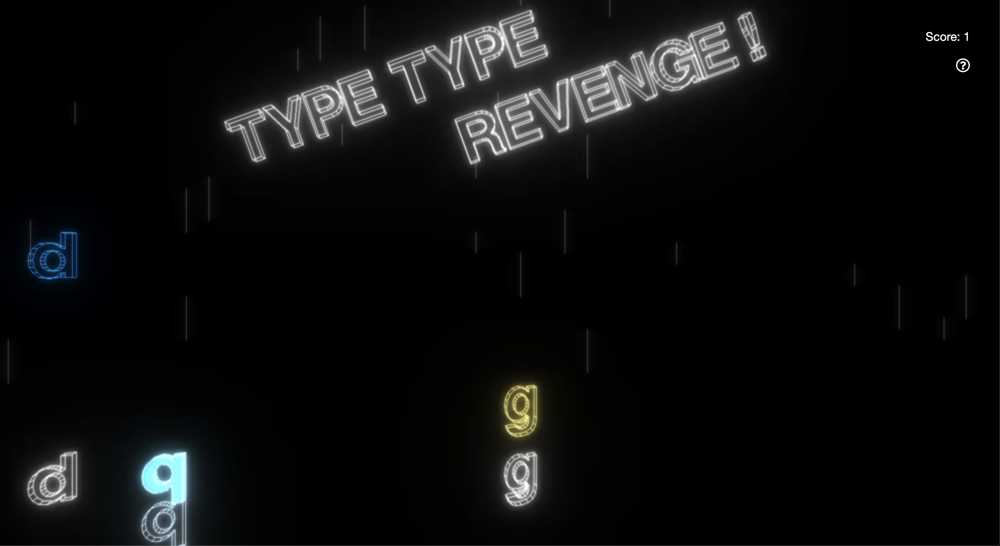
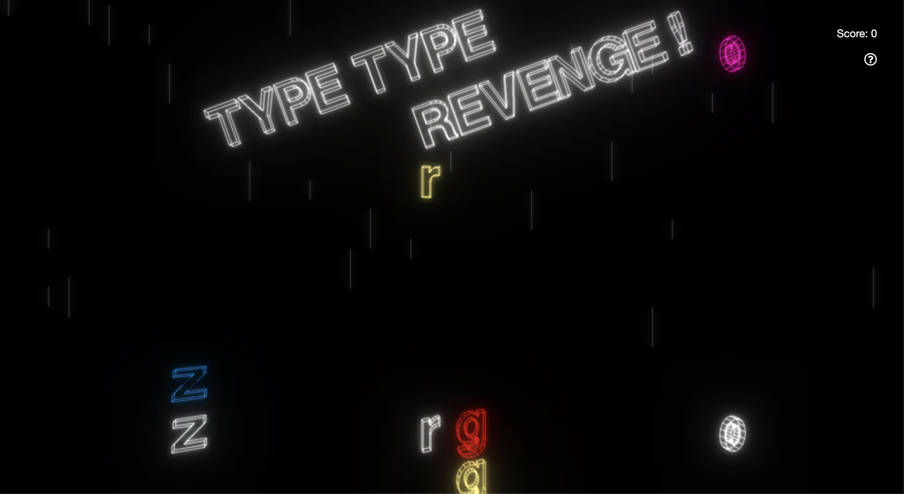

__**Technical Skills/Technologies Used:**__ JavaScript, ThreeJS (libraries)

Link to the game: https://belle-chang.github.io/type-type-revenge 

This project was created for COS426: Computer Graphics as a final project. Modeled after the classic games of Tap Tap Revenge, Guitar Hero, and Dance Dance Revolution, I along with a few others wanted to create a web game that would allow users to practice typing in a more dynamic and engaging way. The premise of the game is as follows: the letters fall from the top of the screen to the beat of a song, and the player must type the corresponding letter on his/her keyboard as they match up with the target outlines at the bottom of the screen:

To create this game, I used seeder code that my TA provided: https://github.com/ReillyBova/three-seed. From here on out, I just created a Letter object class, which was to be added to the scene for every so beat in the song. Within this Letter class, I used ThreeJS's TextGeometry to be able to create the 3-dimensional letters, and provided additional functions that would allow it to fall automatically when it appeared on the screen with TWEEN.js and dispose of it when it finally disappeared off the screen.

I also added an error bar, which would display if the user accidentally typed the wrong letter:

This was done by creating a red box that would sit at the bottom of the main scene, and its visibility would be set to `True` or `False` according to the user's keyboard input.

To demonstrate that the user did type the correct key, our team decided we wanted to have an effect of having the target letter fill with color (since it was previously and edged outline). This was done by adding an additional solid TextGeometry to the Target object class, which was modeled after the Letter object class. Similarly to the error bar, the visibility of the solid TextGeometry would be set to `True` or `False` according to the user's keyboard input.

As you can see in the image above, the 'q' is glowing bright blue!

I also decided that I wanted an effect for when the player missed typing the letter as it falls past the target; this was done by setting the color of the visible mesh on the target to red:

Once the game's components were relatively complete, we decided to create scoring components of the game. So, I created a preliminary ScoreKeeper Class that would update the score if the player typed the right letter, and reset it if he/she didn't.

Of course, this is a work in progress, and there are still many more features that I am planning to implement, but it has been an amazing and greatly enjoyable process throughout. This is the first time I have created a game, and I can see it being a career path I would definitely want to take! :)